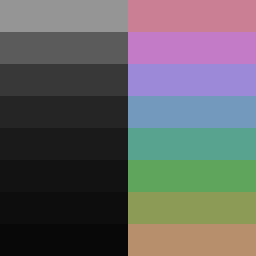

# Underworld

Underworld is a dark color scheme composed of 16 colors whose 8 are grayscale
and other 8 are colorful ones.

## Philosophy

- Very dark background colors.
- Background colors gradient follows the golden ratio.
- Colors distributed evenly across the spectrum.
- All foreground colors have the same lightness.
- Similar colors means similar things.

## Color Table

| #  | HTML    | RGB           | L\*A\*B             |
|----|---------|---------------|---------------------|
| 0  | #080808 |   8,   8,   8 | ~ 2.2,     0,     0 |
| 1  | #0d0d0d |  13,  13,  13 | ~ 3.5,     0,     0 |
| 2  | #121212 |  18,  18,  18 | ~ 5.6,     0,     0 |
| 3  | #1a1a1a |  26,  26,  26 | ~ 9.0,     0,     0 |
| 4  | #252525 |  37,  37,  37 | ~14.6,     0,     0 |
| 5  | #383838 |  56,  56,  56 | ~23.6,     0,     0 |
| 6  | #5a5a5a |  90,  90,  90 | ~38.2,     0,     0 |
| 7  | #959595 | 149, 149, 149 | ~61.8,     0,     0 |
| 8  | #b58e6c | 181, 142, 108 | ~61.8,  10.1,  23.7 |
| 9  | #8d9c55 | 141, 156, 085 | ~61.8, -16.8,  35.3 |
| 10 | #5ea55b | 094, 165, 091 | ~61.8, -37.7,  31.5 |
| 11 | #58a38d | 088, 163, 141 | ~61.8, -28.8,   4.2 |
| 12 | #729abc | 114, 154, 188 | ~61.8, - 4.9, -21.9 |
| 13 | #9a8ad7 | 154, 138, 215 | ~61.8,  22.7, -37.3 |
| 14 | #c47bc7 | 196, 123, 199 | ~61.8,  40.4,  27.9 |
| 15 | #cb7f95 | 203, 127, 149 | ~61.8,  29.4,  12.4 |
