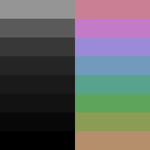

# Underworld

Underworld is a dark color scheme composed of 16 colors whose 8 are grayscale
and other 8 are colorful ones.

## Philosophy

- Darkest possible background.
- Colors distributed evenly across the spectrum.
- All foreground colors have the same lightness.
- Similar colors means similar things.

## Color Table

| #  | Name             | HTML    | RGB           |
|----|------------------|---------|---------------|
| 0  | Black            | #000000 | 000, 000, 000 |
| 1  | Black            | #080808 | 008, 008, 008 |
| 2  | Black            | #121212 | 018, 018, 018 |
| 3  | Nero             | #1a1a1a | 026, 026, 026 |
| 4  | Nero             | #252525 | 037, 037, 037 |
| 5  | Eclipse          | #383838 | 056, 056, 056 |
| 6  | Mortar           | #5a5a5a | 090, 090, 090 |
| 7  | Suva Grey        | #959595 | 149, 149, 149 |
| 8  | Barley Corn      | #b58e6c | 181, 142, 108 |
| 9  | Chelsea Cocumber | #8d9c55 | 141, 156, 085 |
| 10 | Fruit Salad      | #5ea55b | 094, 165, 091 |
| 11 | Cadet Blue       | #58a38d | 088, 163, 141 |
| 12 | Shakespeare      | #729abc | 114, 154, 188 |
| 13 | Portage          | #9a8ad7 | 154, 138, 215 |
| 14 | Lilac Bush       | #c47bc7 | 196, 123, 199 |
| 15 | Puce             | #cb7f95 | 203, 127, 149 |
