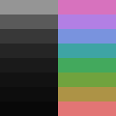

# Underworld

> The rainbow in the darkness.

Underworld is a dark color scheme for Vim.

## Features

- Dark theme.
- Grayscale according to the golden ratio.
- Colors evenly distributed across the spectrum.
- Foreground colors have the same lightness.
- Similar colors have similar meanings.

## Colors

| #  | HTML    | ANSI | HUE    | L\*A\*B L |
|----|---------|------|--------|-----------|
| 00 | #080808 |  232 |   0    |      2.19 |
| 01 | #0d0d0d |  233 |   0    |      3.64 |
| 02 | #121212 |  234 |   0    |      5.46 |
| 03 | #1a1a1a |  235 |   0    |      9.26 |
| 04 | #252525 |  236 |   0    |     14.68 |
| 05 | #383838 |  237 |   0    |     23.52 |
| 06 | #5a5a5a |  240 |   0    |     38.24 |
| 07 | #959595 |  246 |   0    |     61.7  |
| 08 | #e27575 |  174 |   0    |     61.81 |
| 09 | #ad9346 |  137 |  44.85 |     61.82 |
| 10 | #70a33e |   70 |  90.3  |     61.64 |
| 11 | #43a95d |   71 | 135.29 |     61.96 |
| 12 | #3ea4a4 |   73 | 180    |     61.87 |
| 13 | #7993de |   68 | 224.55 |     61.83 |
| 14 | #b27fe4 |  140 | 270.3  |     61.87 |
| 15 | #d772be |  176 | 314.85 |     61.83 |
